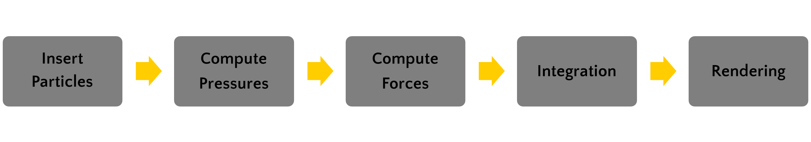
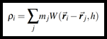
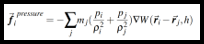
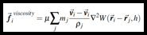
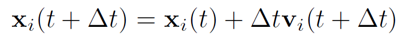
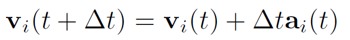

# Real-Time SPH Simulation in C++/CUDA

## Description
This project implements a fluid simulation using the particle-based SPH solver for the Navier-Stokes equations.
The simulation (calculation of densities and forces) was written in CUDA and the rendering was done with OpenGL.
We implemented a typical dambreak scenario which supports two rendering modes: Rendering of individual particles and surface rendering based on Marching Cubes. 

The video below shows a real-time simulation of about 50.000 particles on the GeForce GTX 1080 Ti achieving stable 70 FPS in particle rendering mode and 40 FPS in surface rendering mode.

## Implementation
For SPH the simulation domain is discretized with particles which carry certain properties. In our case, we store the position, velocity, and density for every particle.
From these quantities, the forces acting on the individual particles can be calculated in every timestep to advect them forward in time.
In this implementation only the pressure force, viscosity force, and gravity force were considered. 
To calculate these forces acting on each particle, SPH considers all surrounding particles within a so-called smoothing radius.
Here, a naive algorithm that checks every other particle if it lies within this radius would have a runtime of O(n²).
Hence, we utilized an uniform grid for the neighborhood search which divides the simulation domain into equally-sized cells. In this way, only neighboring cells need to be checked for potential neighbors, reducing the runtime to O(n).
### Simulation Pipeline
The following pipeline summarizes the steps which were performed in every timestep to advect the particles forward in time. 
Each of these steps was implemented in a separate CUDA kernel which is called from the main loop in [main.cu](SPH-CUDA/main.cu).

1. ***[Insert Particles](SPH-CUDA/cell_structure.cuh)***

    Particles are inserted into the uniform grid, i.e. each particle is assigned to one cell. Each cell has the size of the smoothing radius used for SPH.

2. ***[Compute Pressures](SPH-CUDA/calculate_density.cuh)***
   
    Based on the grid, the density at every particles location is calculated. To do this, we simply iterate over each particle and look in its neighbouring cells for other particles that lie within the smoothing radius. Those who do, are included into the density calculation, i.e. only particles within this smoothin radius have influence on the current density. Using the density, we can then calculate the pressure required for the pressure force.

     &nbsp;&nbsp;&nbsp;&nbsp; 

3. ***[Compute Forces](SPH-CUDA/calculate_forces.cuh)***

    We use the densities and pressures from the previous step to calculate the forces acting on every particle. This is the pressure force on the one hand and the viscosity force on the other.
    Again, we mus iterate over all particles and include all neighboring particles in the force calculation that lie within the smoothing radius.

     &nbsp;&nbsp;&nbsp;&nbsp; 

4. ***[Integration](SPH-CUDA/integrators.cuh)***
   
    In the last step the position and the velocity can be calculated from the force. As integration method we first used Forward Euler but this was unstable and made our simulation explode. So we decided to go for Symplectic Euler which conserves the energy exactly. That means particles don’t slow down or accelerate without reason. In Symplectic Euler, the velocity is updated first and then used to update our current position.

     &nbsp;&nbsp;&nbsp;&nbsp; 
   
    We also experimented with the Leapfrog integrator. This is a second-order integrator which requires more computational effort but in return gives a higher accuracy. However, there was no visible difference compared to Symplectic Euler.

5. Rendering
    
    Finally, we render the particles new position. This was done with OpenGL. More precisely, we used CUDA's OpenGL interoperability to directly access the particle data on GPU with OpenGL. 
    The individual particles can be either displayed as spheres or a surface can be drawn using the Marching Cubes algorithm.
    For Marching Cubes the calculated densities from the previous steps were reused.

### Boundary Handling
The boundaries of the transparent box seen in the video above were sampled with particles that were excluded from the rendering. The integration step was skipped for these boundary particles, i.e. they were frozen over the entire simulation.
However, they were assigned a constant density value in the beginning so they could exert pressure on the inner particles as they would approach the boundary and push them inwards again. 

## Usage
Before starting the application, the following simulation parameters can be set in [SPH-CUDA/parameter-files/parameters.par](SPH-CUDA/parameter_files/parameters.par):

| Parameter        | Description           |
| ------------- |:-------------|
| *movable_particle_num* &nbsp;&nbsp;&nbsp;&nbsp;&nbsp;&nbsp;&nbsp;&nbsp;&nbsp;&nbsp;&nbsp;&nbsp;&nbsp;&nbsp;&nbsp;&nbsp;&nbsp;&nbsp;| Amount of simulation particles (Excluding particles used for boundary sampling) |
| *timestep*      | Timestep used during integration      |
| *h* | SPH smoothing radius      |
| *k* | Stiffness used for pressure calculation      |
| *p0* | Rest density used for pressure calculation      |
| *e* | Viscosity constant used for viscosity force |
| *mass* | Particle mass      |
| *g* | Gravity constant      |
| *wall_density* | Density of boundary particles      |
| *min_box_{axis}* | First corner of the simulation domain (box)       |
| *max_box_{axis}* | Second corner of the simulation domain (box)      |
| *spawn_dist* | Initial distance between simulation particles       |
| *boundary_spawn_dist* | Initial distance between boundary particles       |
| *spawn_off_{axis}* | Initial spawn location of particles       |
| *particle_radius* | Rendering size of particles       |

Starting the application, the particles will spawn in a cube-shaped form at the position specified in the parameters file.
The camera view can be moved using `W`, `A`, `S`, `D` buttons. 
It is possible to switch between the two available rendering modes during runtime using the `space` key.
The dam seperating the simulation domain in two parts can be lifted by pressing the `enter` key.

## Prerequisites and Build
This project was developed and tested with CUDA Toolkit 11.6 and the Visual Studio 2019 compiler.
All dependencies related to OpenGL are included within this repository and can be found in the `dependencies/` folder.
To compile this project, you can open the solution file SPH-CUDA.sln within Visual Studio.
The OpenGL dependencies should already be included and listed under `Properties > C/C++ > Additional Include Directories`. 
However, you still have to add the path to your local CUDA installation (`.../CUDA/v11.6/include`).